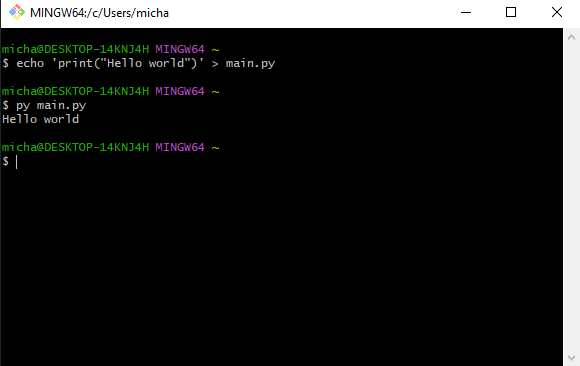

# Hello World – prosty projekt w Pythonie

Prosty projekt napisany w Pythonie, który wypisuje komunikat „Hello world!” oraz demonstruje podstawowe funkcjonalności (dodawanie, odejmowanie, mnożenie), testowanie i automatyczne wdrożenie.



## Funkcjonalności

- Serwer Flask zwracający „Hello world”
- Endpoint \`/health\` zwracający status aplikacji
- Moduł \`calculator.py\` z funkcjami:
  - \`dodaj(a, b)\`
  - \`odejmij(a, b)\`
  - \`pomnoz(a, b)\`
- Testy jednostkowe w \`test_calculator.py\`
- Automatyczne testy i linting (GitHub Actions)
- Automatyczne wdrożenie na Render (Auto Deploy)

## Instalacja

```bash
git clone https://github.com/MichauPopychau/Lab1
cd lab1-git
pip install -r requirements.txt
```

## Użycie lokalne

```bash
python main.py
```

Aplikacja uruchomi się na \`http://localhost:8000/\`.  
Sprawdź health check: \`http://localhost:8000/health\`.

## Testy

Uruchomienie testów jednostkowych:

```bash
python -m unittest discover
```

Sprawdzenie pokrycia kodu:

```bash
coverage run -m unittest discover
coverage report
```

## CI/CD

**GitHub Actions** (\`.github/workflows/ci.yml\`) uruchamia:

1. Testy jednostkowe (\`unittest + coverage ≥100%\`)  
2. Linting (\`flake8\`)

**Render**:

- Auto Deploy przy pushu do \`main\`  
- Build i release kontenera z \`main.py\`  
- Health check pod \`/health\`  
- Ręczny rollback w panelu Render

## Deployment

Aplikacja dostępna jest pod adresem:  
https://lab1-aden.onrender.com

Po każdym \`git push origin main\` Render automatycznie buduje i wdraża nową wersję.

## Zmienne środowiskowe

W Render skonfigurowano:

- \`SECRET=super_secret\`

Wartość odczytywana w \`main.py\` z \`os.environ.get("SECRET")\`.

## Konfiguracja środowiska

- **Hosting**: Render (Web Service)  
- **Serwer**: Flask w \`main.py\`  
- **Moduły**:  
  - \`calculator.py\` (logika)  
  - \`test_calculator.py\` (testy)  
- **Build**: \`pip install -r requirements.txt\`  
- **Start**: \`gunicorn main:app\` lub \`python main.py\`

## Autor

Michał Nosko – [GitHub](https://github.com/MichauPopychau)
